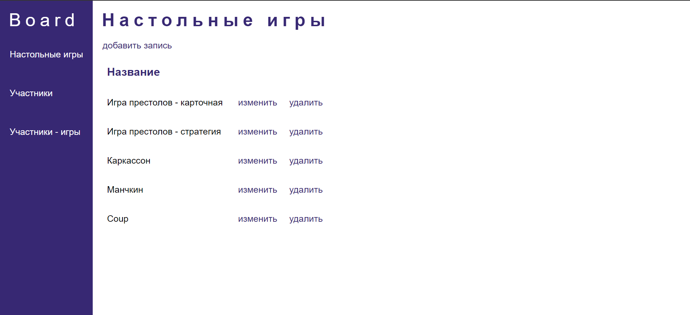
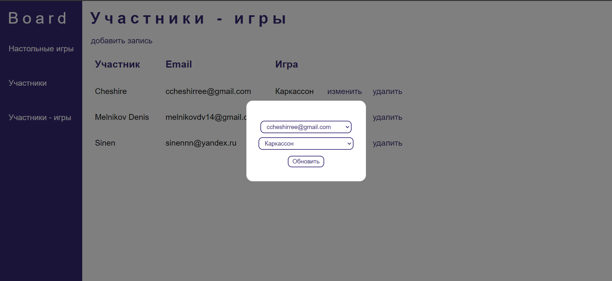

# Board Games Tables Web Site

Simple web site with CRUD operations for 3 tables in database.  
Developed with node.js, express and react.

## How to install

1. Install postgresql and run scripts from '.\board_web_api\dev_docs\db_creation.txt'
2. Run 'cd .\board_web_api && npm i'
3. Run 'cd .\board_react_app && npm i'
4. Change or create new web api config in '.\board_web_api\config' (to read more info: <https://www.npmjs.com/package/config>)
5. Run 'cd .\board_web_api && npm run start'
6. Run 'cd .\board_react_app && npm start'

## Examples

  

 